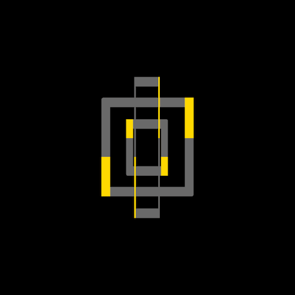

向comehope学习:纯CSS创作矩形旋转loader特效，效果如下:



CSS要努力学习鸭!
<!--less-->

文章来源地址:[大佬链接](https://segmentfault.com/a/1190000014553745)
[效果链接](../Examples/CSS_02/rectangular-rotating-loader-animation.html)

### 代码解读
定义dom,一个包含3个span的容器:
```
<div class="loader">
    <span></span>
    <span></span>
    <span></span>
</div>
```
居中显示:
```
html, body {
    height: 100%;
    display: flex;
    align-items: center;
    justify-content: center;
    background-color: black;
}
```
设置容器的尺寸:
```
.loader {
    width: 150px;
    height: 150px;
    position: relative;
}
```
设置矩形的边框样式:
```
.loader span {
    position: absolute;
    box-sizing: border-box;
    border: 10px solid dimgray;
    border-radius: 2px;
}
```
设置3个矩形的尺寸:
```
.loader span:nth-child(1) {
    width: 100%;
    height: 100%;
}

.loader span:nth-child(2) {
    width: 70%;
    height: 70%;
    margin: 15%;
}

.loader span:nth-child(3) {
    width: 40%;
    height: 40%;
    margin: 30%;
}
```
用伪元素绘制左上和右下装饰条:
```
.loader span::before,
.loader span::after {
    content: '';
    position: absolute;
    width: 10px;
    height: 50%;
    background-color: gold;
}

.loader span::before {
    top: -10px;
    left: -10px;
}

.loader span::after {
    bottom: -10px;
    right: -10px;
}
```
定义动画效果:
```
@keyframes rotating {
    from {
        transform: rotateY(0deg);
    }

    to {
        transform: rotateY(360deg);
    }
}
```
把动画应用到3个矩形上:
```
.loader span {
    animation: rotating linear infinite;
}

.loader span:nth-child(1) {
    animation-duration: 4s;
}

.loader span:nth-child(2) {
    animation-duration: 2s;
}

.loader span:nth-child(3) {
    animation-duration: 1s;
}
```
最后设置3个矩形的堆叠顺序:
```
.loader span:nth-child(1) {
    z-index: 3;
}

.loader span:nth-child(2) {
    z-index: 2;
}

.loader span:nth-child(3) {
    z-index: 1;
}
```

### 知识点梳理

- @keyframes [https://developer.mozilla.org/en-US/docs/Web/CSS/@keyframes](https://developer.mozilla.org/en-US/docs/Web/CSS/@keyframes)