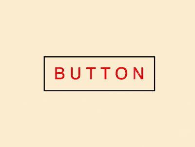

向comehope学习:纯CSS实现一个按钮文字滑动特效，效果如下:



CSS要努力学习鸭!
<!--less-->

文章来源地址:[大佬链接](https://segmentfault.com/a/1190000014534572)
[效果链接](../Examples/CSS_01/button-text-staggered-sliding-effects.html)

### 代码解读

定义DOM，在一个容器定义按钮的文字，每个字母都使用一个span，每个span又有一个data-text属性，具体如下:
```
<div class="box">
    <span data-text="B">B</span>
    <span data-text="U">U</span>
    <span data-text="T">T</span>
    <span data-text="T">T</span>
    <span data-text="O">O</span>
    <span data-text="N">N</span>
</div>
```
按钮居中设置:
```
html, body {
    height: 100%;
    display: flex;
    align-items: center;
    justify-content: center;
}
```
然后设置按钮的尺寸和文字样式:
```
.box {
    width: 200px;
    height: 60px;
    border: 2px solid black;
    text-align: center;
    font-size: 30px;
    line-height: 60px;
    font-family: sans-serif;
}
```
需要将按钮的每个字母元素都设置为行内块元素，这只是为了方便后面单独处理动态效果:
```
.box span {
    display: inline-block;
    color: blue;
}
```
将字母交错显示在按钮容器之外,这里可以将第奇数个元素显示在上，第偶数个元素显示在下:
```
.box span:nth-child(odd) {
    transform: translateY(-100%);
}

.box span:nth-child(even) {
    transform: translateY(100%);
}
```
用伪元素给每个字母增加一个副本
```
.box span::before {
    content: attr(data-text);
    position: absolute;
    color: red;
}
```
然后让伪元素也交错显示，位置与其原始元素相对:
```
.box span:nth-child(odd)::before {
    transform: translateY(100%);
}

.box span:nth-child(even)::before {
    transform: translateY(-100%);
}
```
为增加鼠标划过样式，设置过渡时间:
```
.box:hover span {
    transform: translateY(0);
}

.box span {
    transition: 0.5s;
}
```
最后一步，隐藏容器外的内容:
```
.box {
    overflow: hidden;
}
```

### 知识点梳理
#### flex布局
&nbsp;&nbsp;&nbsp;&nbsp;&nbsp;&nbsp;比较好的一个学习总结:[链接跳转处](https://www.cnblogs.com/    nuannuan7362/p/5823381.html)

#### justify-content属性
&nbsp;&nbsp;&nbsp;&nbsp;&nbsp;&nbsp;用于设置或者检索弹性盒子元素在主轴(横轴)方向上的对齐方式。可以参看[菜鸟教程](http://www.runoob.com/cssref/css3-pr-justify-content.html)

#### 百分比%
&nbsp;&nbsp;&nbsp;&nbsp;&nbsp;&nbsp;[CSS中的百分比计算方法](http://www.runoob.com/w3cnote/css-percentage-calculation.html)
#### 伪元素(Pseudo-elements)->before,after
&nbsp;&nbsp;&nbsp;&nbsp;&nbsp;&nbsp;[W3School上的讲解](http://www.w3school.com.cn/css/css_pseudo_elements.asp)

#### translateY
&nbsp;&nbsp;&nbsp;&nbsp;&nbsp;&nbsp;[jQery之家的解释](http://www.htmleaf.com/ziliaoku/qianduanjiaocheng/translateY.html)

#### data-*
&nbsp;&nbsp;&nbsp;&nbsp;&nbsp;&nbsp;用于嵌套自定义数据,[移步W3School](http://www.w3school.com.cn/tags/att_global_data.asp)

#### content
&nbsp;&nbsp;&nbsp;&nbsp;&nbsp;&nbsp;用于插入生成内容,[链接跳转](http://www.w3school.com.cn/cssref/pr_gen_content.asp)

#### nth-child
&nbsp;&nbsp;&nbsp;&nbsp;&nbsp;&nbsp;常见的选择器了，再好好复习一下吧,[链接跳转](http://www.w3school.com.cn/cssref/selector_nth-child.asp)

