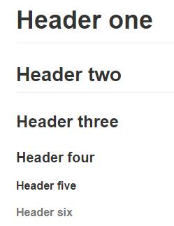

Following the mardkdowntutorial.

Markdown is a way to write content for the web. It’s written in what nerds like to call “plaintext”, which is exactly the sort of text you’re used to writing and seeing. Plaintext is just the regular alphabet, with a few familiar symbols, like asterisks ( * ) and backticks ( ` ).

Unlike cumbersome word processing applications, text written in Markdown can be easily shared between computers, mobile phones, and people. It’s quickly becoming the writing standard for academics, scientists, writers, and many more. Websites like GitHub and reddit use Markdown to style their comments.

Formatting text in Markdown has a very gentle learning curve. It doesn’t do anything fancy like change the font size, color, or type. All you have control over is the display of the text—stuff like making things bold, creating headers, and organizing lists.

<!--less-->

### Italics and Bold
To make a phrase italic in Markdown, you can surround words with an underscore `(_ )`. For example, `_this_`(_this_ )word would become italic.

Similarly, to make phrases bold in Markdown, you can surround words with two asterisks `( ** )`. This will `**really**`(**really**) get your point across.

Of course, you can use `_both italics and bold_` in the same line. You can also span them `**across multiple words**`.

Finally,we're going to make some words _bold **and** italic_.In general, it doesn't matter which order you place the asterisks or underscores.

### Headers
To make headers in Markdown, you preface the phrase with a hash mark `(#)`. You place the same number of hash marks as the size of the header you want.For example:
```
# Header one
## Header two
### Header three
#### Header four
##### Header five
###### Header six
```
效果为


It's up to you to decide when it's appropriate to use which header. In general, headers one and six should be used sparingly.

You can't really make a header bold, but you can italicize certain words.
(Obviously,`(_)`is good!)

### Links
There are two different link types in Markdown, but both of them render the exact same way. The first link style is called an inline link. To create an inline link, you wrap the link text in brackets `( [ ] )`, and then you wrap the link in parenthesis `( ( ) )`. For example, to create a hyperlink to www.github.com, with a link text that says, Visit GitHub!, you'd write this in Markdown: `[Visit GitHub!](www.github.com)`.

You can add emphasis to link texts, if you like.

Although it might make for an awkward experience, you can make links within headings, too.

That's all there is to writing inline links.

The other link type is called a reference link. As the name implies, the link is actually a reference to another place in the document. Here's an example of what we mean:

```
Here's [a link to something else][another place].
Here's [yet another link][another-link].
And now back to [the first link][another place].

[another place]: www.github.com
[another-link]: www.google.com
```

The "references" above are the second set of brackets: [another place] and [another-link]. At the bottom of a Markdown document, these brackets are defined as proper links to outside websites. An advantage of the reference link style is that multiple links to the same place only need to be updated once. For example, if we decide to make all of the [another place] links go somewhere else, we only have to change the single reference link.

Reference links don't appear in the rendered Markdown. You define them by providing the same tag name wrapped in brackets, followed by a colon, followed by the link.

### Images
If you know how to create links in Markdown, you can create images, too. The syntax is nearly the same.

Images also have two styles, just like links, and both of them render the exact same way. The difference between links and images is that images are prefaced with an exclamation point `( ! )`.

The first image style is called an inline image link. To create an inline image link, enter an exclamation point `( ! )`, wrap the alt text in brackets `( [ ] )`, and then wrap the link in parenthesis `( ( ) )`. (Alt text is a phrase or sentence that describes the image for the visually impaired.)

For example, to create an inline image link to the link (a bannekat picture from the github). https://octodex.github.com/images/bannekat.png, with an alt text that says, Benjamin Bannekat, you'd write this in Markdown:
`.`

Although you don't need to add alt text, it will make your content accessible to your audience, including people who are visually impaired, use screen readers, or do not have high speed internet connections.

For a reference image, you'll follow the same pattern as a reference link. You'll precede the Markdown with an exclamation point, then provide two brackets for the alt text, and then two more for the image tag. At the bottom of your Markdown page, you'll define an image for the tag.

### Blockquotes
If you need to call special attention to a quote from another source, or design a pull quote for a magazine article, then Markdown's blockquote syntax will be useful. A blockquote is a sentence or paragraph that's been specially formatted to draw attention to the reader. For example:
>"The sin of doing nothing is the deadliest of all the seven sins. It has been said that for evil men to accomplish their purpose it is only necessary that good men should do nothing."

To create a block quote, all you have to do is preface a line with the "greater than" caret (>). For example:
```
> "In a few moments he was barefoot, his stockings folded in his pockets and
his canvas shoes dangling by their knotted laces over his shoulders and,
picking a pointed salt-eaten stick out of the jetsam among the rocks, he
clambered down the slope of the breakwater."
```

You can also place a caret character on each line of the quote. This is particularly useful if your quote spans multiple paragraphs.

Block quotes can contain other Markdown elements, such as italics, images, or links.

### Lists
There are two types of lists in the known universe: unordered and ordered. That's a fancy way of saying that there are lists with bullet points, and lists with numbers.

To create an unordered list, you'll want to preface each item in the list with an asterisk ( * ). Each list item also gets its own line. For example, a grocery list in Markdown might look like this:
```
* Milk
* Eggs
* Salmon
* Butter
```

All right! That's how you write an unordered list. Now, let's talk about ordered ones.

An ordered list is prefaced with numbers, instead of asterisks. Take a look at this recipe:
1. Crack three eggs over a bowl
2. Pour a gallon of milk into the bowl
3. Rub the salmon vigorously with butter
4. Drop the salmon into the egg-milk bowl

To write that in Markdown, you'd do this:
```
1. Crack three eggs over a bowl
2. Pour a gallon of milk into the bowl
3. Rub the salmon vigorously with butter
4. Drop the salmon into the egg-milk bowl
```
You can choose to add italics, bold, or links within lists, as you might expect.

Occasionally, you might find the need to make a list with more depth, or, to nest one list within another. Have no fear, because the Markdown syntax is exactly the same. All you have to do is to remember to indent each asterisk one space more than the preceding item.

For example, in the following list, we're going to add some sub-lists to each "main" list item, describing the people in detail:
```
* Tintin
 * A reporter
 * Has poofy orange hair
 * Friends with the world's most awesome dog
* Haddock
 * A sea captain
 * Has a fantastic beard
 * Loves whiskey
   * Possibly also scotch?
```
When rendered, this list turns into the following grouping:
* Tintin
 * A reporter
 * Has poofy orange hair
 * Friends with the world's most awesome dog
* Haddock
 * A sea captain
 * Has a fantastic beard
 * Loves whiskey
   * Possibly also scotch?

While you could continue to indent and add sub-lists indefinitely, it's usually a good idea to stop after three levels; otherwise, your text becomes a mess.

There's one more trick to lists and indentation that we'll explore, and that deals with the case of paragraphs. Suppose you want to create a bullet list that requires some additional context (but not another list).

To create this sort of text, your paragraph must start on a line all by itself underneath the bullet point, and it must be indented by at least one space.

Notice that the first two items have a single space. This looks a bit odd, so you might want to indent properly to match the characters up (like items three and four). In these paragraphs, you can include all sorts of other Markdown elements, like blockquotes, or even other lists!

### Paragraphs
Each dot `( · )` represents a space on the keyboard.You can accomplish a soft break by inserting two spaces after each new line.