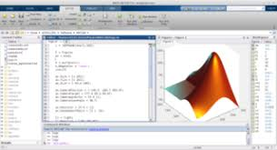

MATLAB还不学习，岂不要凉凉?!

MATLAB数值计算和绘图要经常上手鸭！

<!--less-->

## MATLAB概述
说白了，就是因为繁重的计算算不过来，科学研究中也有大量的数学计算，Matlab等无疑让科技人员得到了解脱。(X

### 发展历史
FORTRAN->C->......

### 主要功能和特点
MATLAB是真的强大...(小声比比)
- 主要功能有:
 1. 数值计算
 2. 符号计算
 3. 数值分析和可视化功能
 4. SIMULINK动态仿真功能...
- 主要特点:
 1. 可扩展性:(M文件)
 2. 易学易用性(等于没说)
 3. 高效性(FFT那边用起来太爽了吧)

### MATLAB命令窗口
注意一下工作空间，路径，SIMULINK模块库即可

|      键名     |            功能         |      键名     |        功能        |
| :-----------: |:----------------------:|:-------------:|:------------------:|
|       ↑       | 前寻式调回已输入过的命令 |      Home     | 将光标移到当前行首端 |
|       ↓       | 前寻式调回已输入过的命令 |      End      | 将光标移到当前行末端 |
|       ←       |   在当前行向左移动光标   |      Del      |  删除光标右边的字符  |
|       →       |   在当前行向右移动光标   |   BackSpace   |  删除光标左边的字符  |
|      PgUp     |      前寻式翻滚一页      |     ESC      |   删除当前行全部内容 |
|      PgDn     |      后寻式翻滚一页      |              |                    |

### MATLAB文件管理
**当前目录**的设置有点坑...

### MATLAB获取帮助
[MathWorks](http://www.mathworks.com)

help命令大法...

### MATLAB功能演示
 - demo命令
 - Examples and Demos
然后去试试吧

## MATLAB程序设计

## MATLAB数值计算

## MATLAB符号计算

## MATLAB绘图

## SIMULINK仿真

## MATLAB辅助优化设计

## MATLAB神经网络分析与设计

## MATLAB程序接口