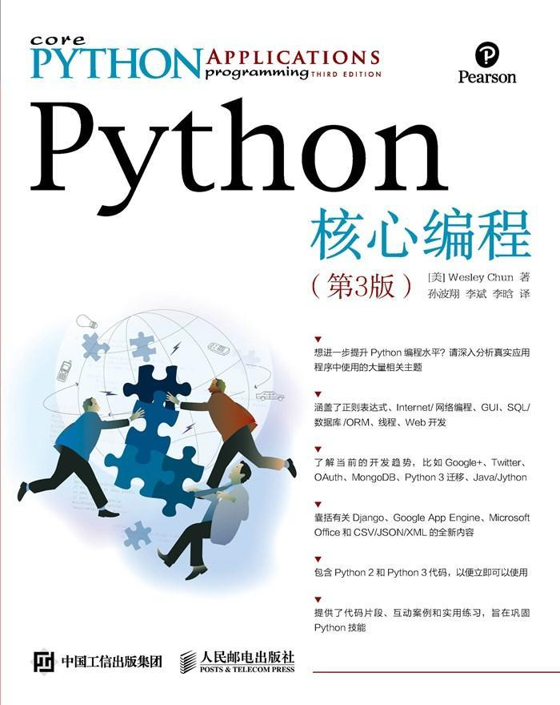

学会了基本语法后，也该入门了。

s...struggle!

Chapter One---Regex

<!--less-->

## 第一章:正则表达式

### 简介/动机

### 特殊符号和字符

#### 使用择一匹配符号匹配多个正则表达式模式

#### 匹配任意单个字符

#### 从字符串起始或者结尾或者单词边界匹配

#### 创建字符集

#### 限定范围和否定

#### 使用闭包操作符实现存在性和频数匹配

#### 表示字符集和特殊符号

#### 使用圆括号指定分组

#### 扩展表示法

### 正则表达式和Python语言

#### re模块:核心函数和方法

#### 使用compile()函数编译正则表达式

#### 匹配对象以及group()和groups()方法

#### 使用match()方法匹配字符串

#### 使用search()在一个字符串中查找模式(搜索和匹配的对比)

#### 匹配多个字符串

#### 匹配任意单个字符串(.)

#### 创建字符集([])

#### 重复、特殊字符以及分组

#### 匹配字符串的起始和结尾以及单词边界

#### 使用findall()和finditer()查找每一次出现的位置

#### 使用sub()和subn()搜索和替换

#### 在限定模式上使用split()分隔字符串

#### 扩展字符

#### 杂项

### 一些正则表达式实例

### 更长的正则表达式实例

#### 匹配字符串

#### 搜索与匹配...还有贪婪
