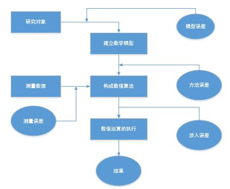

### 《计算方法》
- 数值计算中的误差
- 插值法
- 曲线拟合的最小二乘法
- 数值积分
- 非线性方程的数值解法
- 方程组的数值解法
- 常微分方程的数值解法

### 主要内容
- 数值逼近
    + 插值法
    + 数值拟合的最小二乘法
    + 数值积分和数值微分
- 数值代数
    + 线性方程组的求解
    + 非线性方程组的求解
    + 矩阵特征值<sup>*</sup>
- 常微分方程的数值方法

<!--less-->

##### 科学与工程问题的解决步骤:
```flow
op1=>operation: 实际问题
op2=>operation: 建立数学模型
op3=>operation: 构造数值算法
op4=>operation: 编程上机
op5=>operation: 获取近似结果
op1(right)->op2(right)->op3->op4->op5
```

##### 误差来源与误差分析

 - 模型误差
 - 观测误差
 - 截断误差
 - 舍入误差

###### ***误差分析的重要性:病态问题***
 - 定义:初始数据的微小变化，导致计算结果产生很大影响，则问题是病态的，相反时良态的；
 - 例:$f(x)=x^2+x-1150$在$x^{\*}=100/3$的值
    解:$f(100/3)=-\frac{50}{9}\approx-5.6$
   &nbsp;&nbsp;&nbsp;&nbsp;$f(33)=-28$
   &nbsp;&nbsp;&nbsp;&nbsp;所以该函数是病态的。
    分析:
    $\|x^{\*}-x\|=\frac{1}{3}<0.34$,$\|f(x^{\*})-f(x)|\approx22.4$
    $\|\frac{x^{\*}-x}{x^{\*}}\|=\frac{\frac{1}{3}}{\frac{100}{3}}=1\%$,$\|\frac{f(x^{\*})-f(x)}{f(x^{\*})}\|=\frac{\frac{-50}{9}+28}{\frac{-50}{9}}\approx400\%$

###### ***误差分析的重要性:算法的数值稳定性***
 - 例:计算 $I_n=\int_{0}^{1}\frac{x^{n}}{x+5}{\rm d}x$
 - 构造算法如下:
   $I_n+5I_{n-1}=\int_0^1\frac{x^n+5x^{n-1}}{x+5}{\rm d}x=\int_0^1x^{n-1}{\rm d}x=\frac{1}{n}$
   - 算法一. &nbsp;$I_n=\frac{1}{n}-5I_{n-1},I_0=\ln{\frac{6}{5}}$  $\quad$ $\check{I}$
   - 算法二. &nbsp;$I_{n-1}=\frac{1}{5}(\frac{1}{n}-I_n),I_8=0.0019$ $\quad$ $\grave{I}$
 - 容易知道，对于任何自然数n，都有$0<I_n<1$并且$I_n$单调减，因此代入n=1...7可知，算法1是不稳定的，算法2是稳定的.
 - 对于算法1，有:
   $I_n=\frac{1}{n}-5I_{n-1},\check{I_{n}^{(1)}}=\frac{1}{n}-5\check{I}_{n-1}^{(1)}$
   得知误差 $\epsilon\_i^{(1)}=I_{i}-\check{I}_i^{(1)}$
    $\epsilon\_n^{(1)}=-5\check{\epsilon}_{n-1}^{(1)}=(-5)^{n}\epsilon\_0^{(1)},n=1,2,...$，可见误差随着运行过程传播并积累，因此算法1是不稳定的。
 - 同理，对于算法2，<!-- 有:
   得知误差 $\epsilon\_i^{(2)}=I_{i}-\check{I}_i^{(2)}$
    $\epsilon\_n^{(1)}=-5\check{\epsilon}_{n-1}^{(1)}=(-5)^{n}\epsilon\_0^{(1)},n=1,2,...$， -->可知算法2是稳定的。
